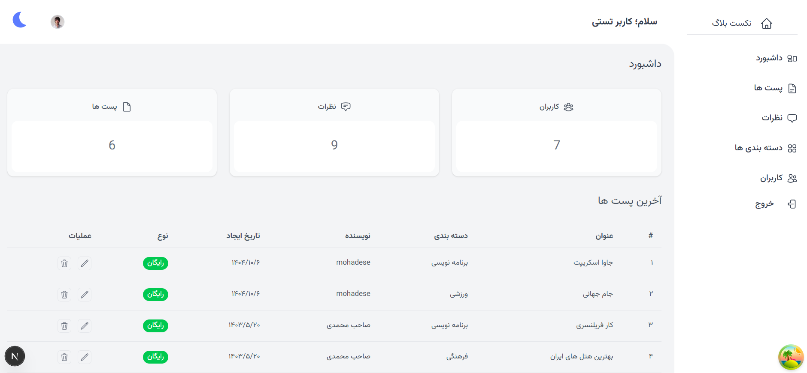
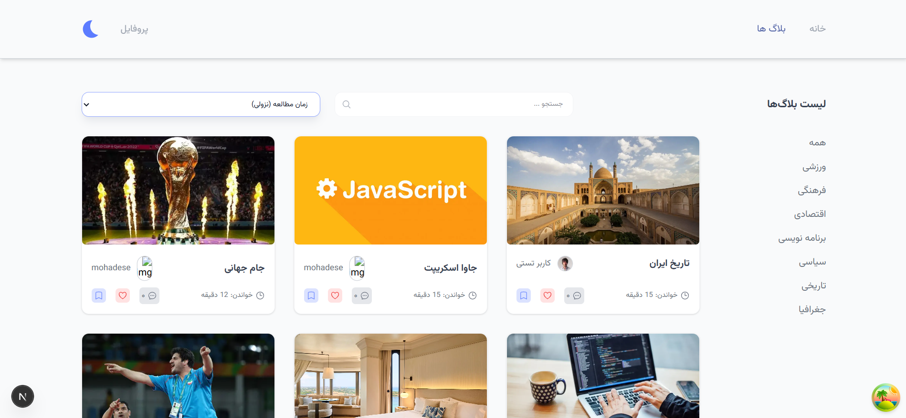
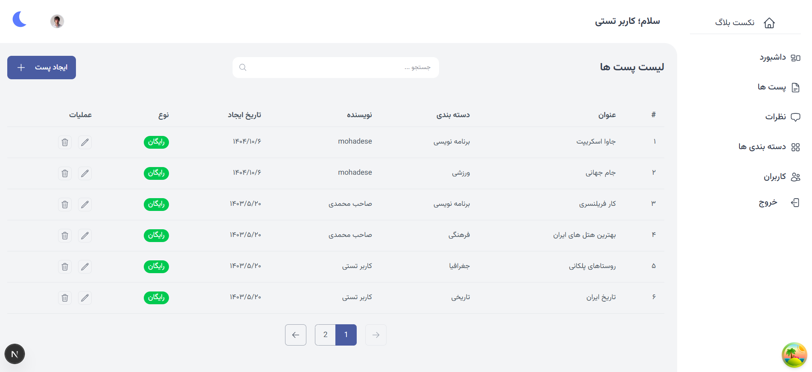
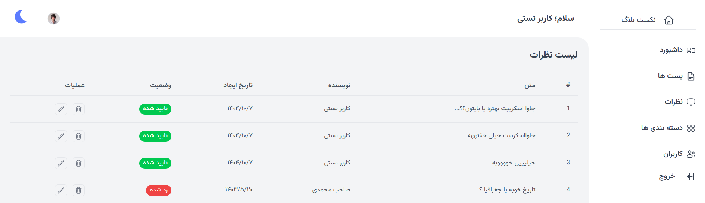
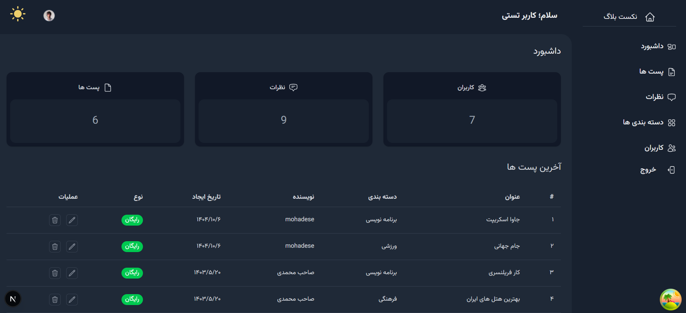
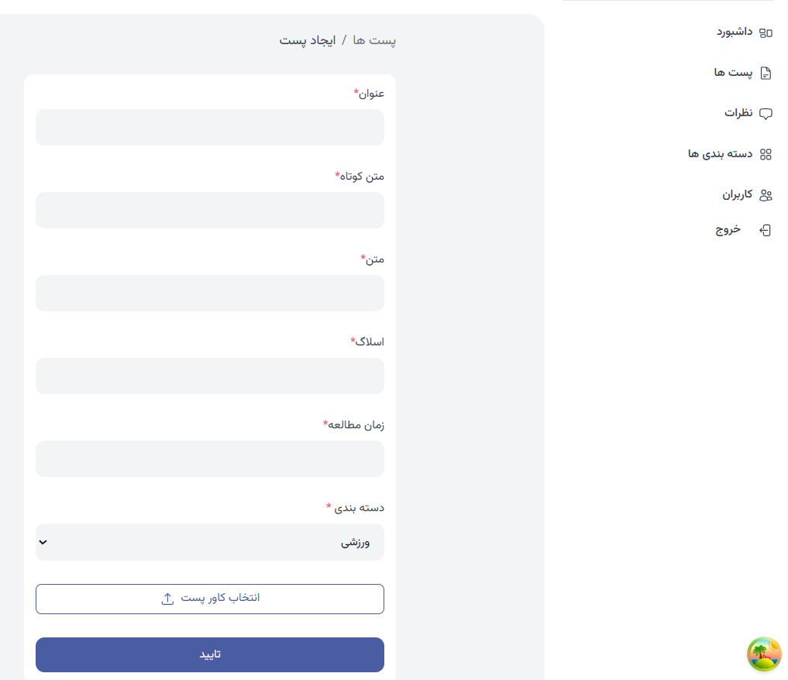

# Next Blog App

A full-featured blog dashboard built with Next.js where admins can manage posts, categories, and comments.

## Demo
📸 Screenshots:

 
 
 
 
 
 
 

## Features
- Authentication and protected routes
- Create, edit, and delete blog posts
- Category and comments management
- Like and save posts
- Sorting and filtering posts
- Responsive dashboard UI
- Persian (RTL) support
- Dark mode

## Tech Stack
- Next.js
- React
- Tailwind CSS
- Node.js & Express
- MongoDB
- JWT Authentication

## Challenges & Learnings
- Implemented protected routes using middleware and authentication checks
- Managed server-side authentication in a Next.js application
- Handled RTL layouts and Persian UI challenges in dashboard design
- Improved component reusability by refactoring repeated UI patterns
- Worked with sorting and filtering logic on the frontend

## Libraries & Tools
- React Query – server state management and data fetching
- React Hook Form – form handling and validation
- Axios – API communication

## Getting Started

### Prerequisites
- Node.js (v18+)
- MongoDB (local or cloud)

### Installation
```bash
git clone https://github.com/your-username/next-blog-app.git
cd next-blog-app
npm install
